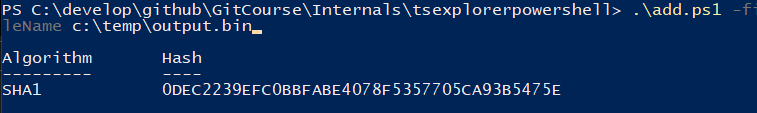

# Powershell git internals

## add.ps1

A simple sequence of PowerShell instruction that will take a file and **calculates the hash of the file adding standard git headers**.

```bash
# Once in a git repository you can simply add a blob object directly to git
git hash-object helloworld.txt
```

This will typically compress the object and stores it into internal database and **it will return the hash of the file, that is the filename of the object in internal database**.


Now you can test with this powershell to generate an identical file to mimic what **git does under the hood**.

```powershell
.\add.ps1 -fileName C:\temp\test\helloworld.txt -outputFileName c:\temp\output.bin
```

And this should return you the very same hash returned by git, **confirming that we have created the very same blob**.



The hash are identical, thus confirming git file internal format. The two files are not identical on disk because Git will then compress the file with gzip to reduce dimension.+

> The routine inside the powershll with use standard Gzip compression stream to write a compressed object. You will find that the object written differs from the one writted by git, because the standard .NET class append headers and other stuff, but the core parte is indeed equal.

As you can see from below picture, standard gzip comopression (as done with .NET powershell) generates upper file, where **we have a bigger header but the core part of the file is identical, confirming that indeed git gzip file content**. As you can see the [1F8B08 is standard gzip header](https://www.filesignatures.net/index.php?page=search&search=1F8B08&mode=SIG)


